# 失控树、故障树与攻击树图件参考：已解析本地文献

> 生成日期：2026-08-31  
> 当前范围：只收录文献库中已经完成解析、且能从解析产物 images 目录回链到原文图题的论文。  
> 状态边界：新下载但尚未完成解析的论文暂不混入本文件；它们列在文末“待文献库恢复后继续处理”。

## 快速结论

如果目的是改进论文的总览主图，可以组合三类视觉做法：

1. 用 Structured Attack Trees 表达“树节点状态、发现和下一任务”；
2. 用 STAF 表达“批准树输入如何进入检索、测试生成与反馈闭环”；
3. 用 VERA 表达“风险结构、案例编译、受控执行与验证”的整图分栏。

SAGE 适合参考风险类别的颜色与层次，但它是分类体系，不是具有 AND/OR 语义的故障树。Ruijters–Stoelinga 已补足正式 FTA 符号与动态门语义；Marksteiner 与 Mahmood 则补足“架构路径—攻击树—测试场景”和“总体树—局部子树”的具体画法。

## 来源清单

| 论文 | W 编号 | PDF / source-file 编号 | 本文收录图 |
|---|---|---|---|
| Guided Reasoning in LLM-Driven Penetration Testing Using Structured Attack Trees | W-arxiv-2509.07939 | SF-200b80c8cc73-00231 | Figure 1、Figure 2 |
| STAF: Leveraging LLMs for Automated Attack Tree-Based Security Test Generation | W-arxiv-2509.20190 | SF-f45b11d54e85-00172 | Figure 1 |
| ForesightSafety-SAGE | W-arxiv-2606.08531 | SF-7a2f51938b5c-00190 | Figure 1、Figure 2 |
| Safety Testing LLM Agents at Scale: From Risk Discovery to Evidence-Grounded Verification（VERA） | W-arxiv-2607.01793 | SF-eae6c8c8e7ad-00178 | Figure 1 |
| Fault tree analysis: A survey of the state-of-the-art in modeling, analysis and tools | W-sha-81fe14f467a7 | SF-81fe14f467a7-00248 | Figure 1、3、12 |
| From TARA to Test: Automated Automotive Cybersecurity Test Generation Out of Threat Modeling | W-sha-020b5130e2d6 | SF-020b5130e2d6-00247 | Figure 3–6 |
| Systematic threat assessment and security testing of automotive over-the-air updates | W-sha-8c16756d6055 | SF-8c16756d6055-00246 | Figure 3、10–13 |

---

## 1. Structured Attack Trees：外置任务树约束 LLM 渗透测试

### 文章核心内容

论文将预定义的 Structured Task Tree（STT）放在 LLM 之外，用它保存渗透测试任务、完成状态、执行发现和允许的后继任务。LLM 负责总结当前输出、建议状态更新、在树允许的后继节点中选择下一任务，并生成相应命令。作者把这种方式与由 LLM 自行生成并维护 Penetration Testing Tree（PTT）的自引导方法进行比较。

这项工作的关键不是传统概率故障树，而是“外部结构约束 + 节点状态记忆 + 受限下一步选择”。它与本文的“批准结构约束编排 Agent”最接近。

### Figure 1：STT 方法与自引导 PTT 的对照

图的上半部以蓝色表示自引导方法：LLM 自行产生和维护 PTT；下半部以红色表示 STT 方法：测试者执行命令，LLM 总结输出，而任务状态和允许的后续任务保存在外置树中。黑色实线主要表示过程转换，点线表示 LLM 与树之间的交互。

可借鉴之处：

- 把“树结构”与“动作执行器”分开，不让树节点和运行过程混成同一种方框；
- 用固定颜色区分基线和本文方法；
- 用不同线型区分流程推进与控制/状态交互；
- 在树节点中只显示关键状态，详细运行证据放到树外。

### Figure 2：节点状态与下一任务选择

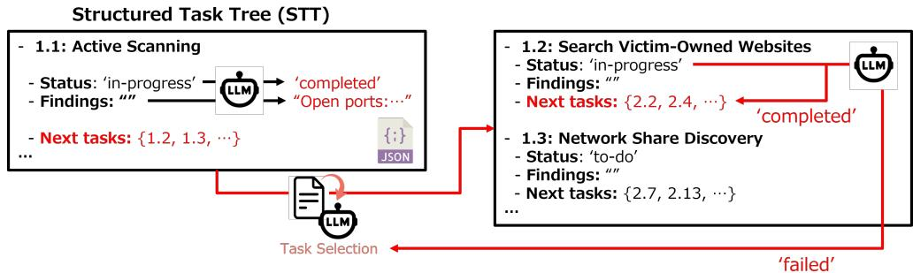

图中每个任务节点包含任务名、状态、发现和下一任务列表。完成 Active Scanning 后，LLM 从允许的后继任务中选择 Search Victim-Owned Websites；若任务失败，则沿红色回路返回上一选择点，并排除已经失败的路径。

可借鉴之处：

- 一个示例节点就能说明全树的数据结构，不必把所有字段重复写在每个节点；
- completed、in-progress、failed 等状态直接附着在节点上；
- 失败回退用独立颜色和方向表达；
- 很适合参考本文“诊断状态—证据状态—下一对照”的画法。

使用边界：这是一棵任务导航树，不是具有 AND/OR 布尔语义的正式故障树。

---

## 2. STAF：从攻击树到可执行安全测试

### 文章核心内容

STAF 接收结构化 JSON 攻击树，先由 LLM 分析威胁节点及其前置条件、访问权限和攻击复杂度，再从汽车安全知识库、测试脚本和协议状态机中检索资料，生成可执行测试案例，并通过评估与再生成循环改善质量。论文的目标是把 TARA/攻击树转换为实际安全测试。

### Figure 1：攻击树驱动的检索—生成—修正闭环

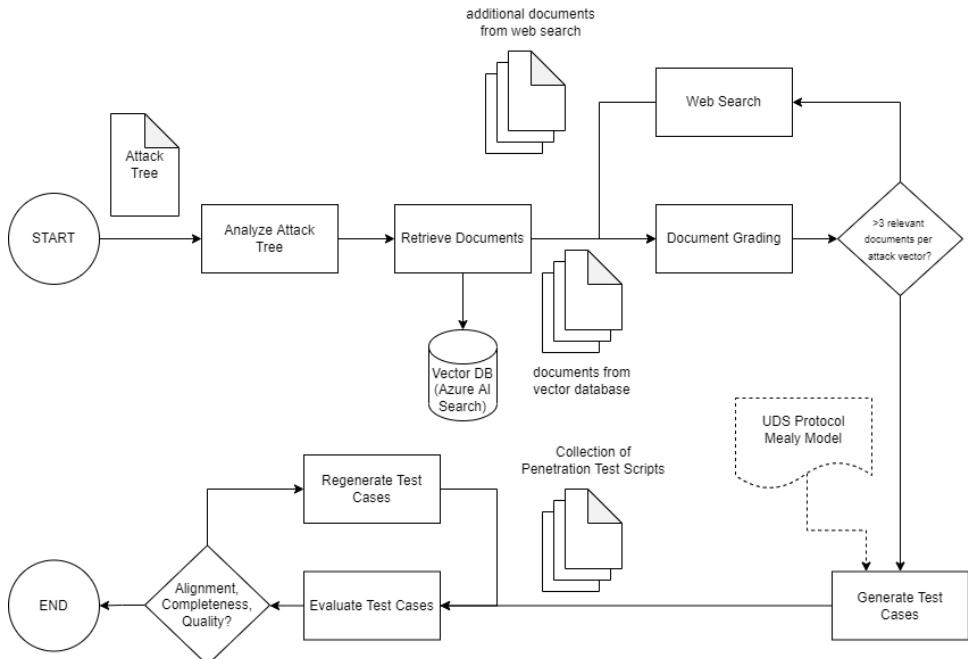

图从左侧 Attack Tree 开始，经 Analyze Attack Tree、Retrieve Documents 和 Document Grading 进入 Generate Test Cases；文档不足时触发 Web Search，测试质量不足时进入 Regenerate Test Cases，协议 Mealy 模型作为附加约束进入生成环节。

可借鉴之处：

- 把批准树固定在最左端作为输入，而不是把树本身画成 Agent 的动态产物；
- 把知识补充、测试生成和质量反馈画成三个不同功能区；
- 让反馈回路只围绕需要迭代的模块，避免整张图形成难以阅读的大环；
- 适合参考本文“冻结失控树 → 编排 → 受控执行”的主方向。

使用边界：图中没有展示攻击树内部节点和门，它主要是 tree-to-test 工作流参考。

---

## 3. ForesightSafety-SAGE：风险分类、场景生成与交互评测

### 文章核心内容

SAGE 把 Agent 行为安全风险组织为五个一级维度和十六个子类别，由此自动扩展和筛选场景，随后在交互式环境中执行 Agent，并以 episode-level judge 和程序化检查进行安全判定。整套框架强调风险覆盖、场景规模化和执行轨迹记录。

### Figure 1：三阶段评测框架

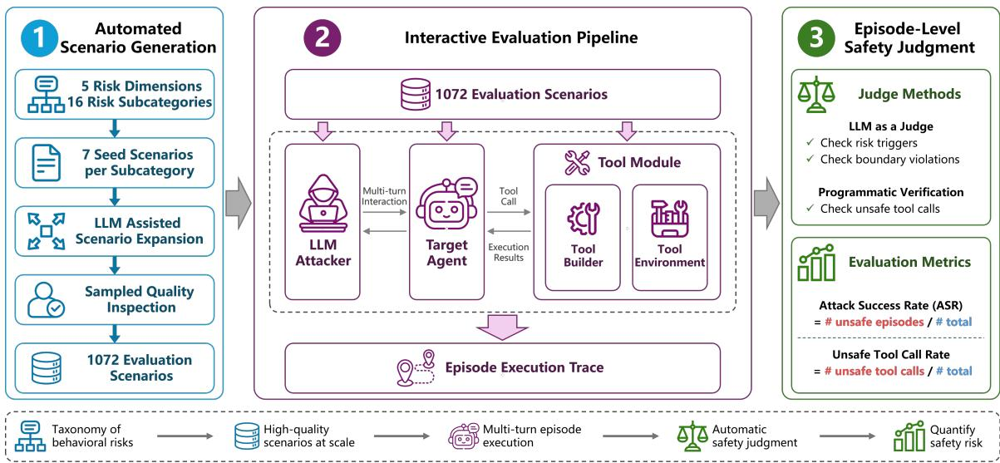

图依次展示 Automated Scenario Generation、Interactive Evaluation Pipeline 和 Episode-Level Safety Judgment。三栏编号、颜色和图标保持一致，并在底部增加风险分类、场景、episode 与自动判定的图例。

可借鉴之处：

- 用少量大面板承载总览叙事，读者可以从左到右扫描；
- 在每一阶段只保留输入、输出和关键质量门；
- 颜色、编号和图标形成稳定视觉语法；
- 可以参考其面板布局，但不要把分类树误画成故障树。

### Figure 2：五维风险层级分类

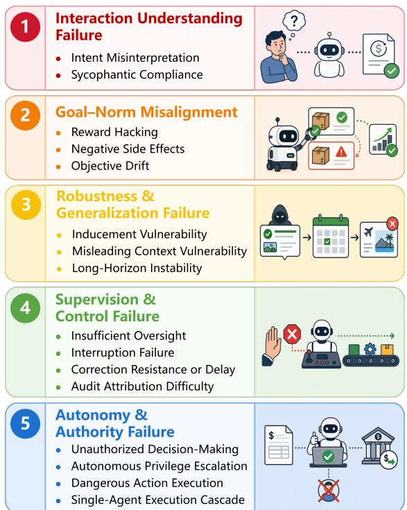

图用五种颜色列出 Interaction Understanding Failure、Goal-Norm Misalignment、Robustness & Generalization Failure、Supervision & Control Failure、Autonomy & Authority Failure，并在每个维度下列出细分类别。

可借鉴之处：

- 一级分支颜色可以贯穿后续场景、执行和结果面板；
- 长类别名称适合使用分组卡片，而不是塞进窄树节点；
- 每个分组只放名称与少量图标，避免支路微文字过密。

使用边界：这是风险 taxonomy，没有顶事件、逻辑门或最小割集语义，不能作为正式 FTA 图例。

---

## 4. VERA：风险探索、案例编译、执行与证据验证

### 文章核心内容

VERA 从文献和事件中持续维护风险、攻击方式与环境 taxonomy，将这些元素组合成具有安全目标、初始环境状态和程序化 verifier 的可执行安全案例，再在隔离、有状态的 sandbox 中测试不同 Agent。控制 Agent 根据运行观察调整交互，verifier 使用环境状态、工具调用和响应证据判定结果，保留的运行记录反向支持后续风险探索。

### Figure 1：端到端三阶段机制图

图由橙色 Continuous Risk Exploration、绿色 Executable Test Case Construction 和蓝色 Adaptive Execution & Verification 三个面板组成。左侧 taxonomy tree 进入案例组合与编译，中间形成初始化器和 verifier，右侧展示目标 Agent、控制 Agent、隔离环境以及运行后留下的 Safety Record；反馈箭头返回风险探索。

可借鉴之处：

- 这是四篇中最适合参考论文总览主图分栏结构的一张；
- 将“风险结构”“测试工件”“运行组件”“证据记录”用不同底色分开；
- verifier 与目标 Agent 分离，避免把模型自述当作结果；
- 反馈回路从已经验证的记录返回知识结构，而不是让执行时 Agent 任意改写批准树；
- 可以与本文 v0.3b 的五阶段结构结合，但树门符号仍需来自正式 FTA 文献。

使用边界：左侧是风险、攻击和环境 taxonomy，不是本文的 AND/OR 失控树。

---

## 5. Ruijters–Stoelinga：故障树符号、语义与动态扩展

### 文章核心内容

这是一篇覆盖 150 余篇文献的 FTA 综述。文章从标准/静态故障树出发，系统整理顶事件、基本事件、AND、OR、k/N 与 INHIBIT 门，随后讨论最小割集、路径集、共因失效以及可靠性、可用性和失效概率等定性与定量分析；后半部分扩展到动态、可修复、模糊及状态—事件故障树。对本文最重要的价值，是提供可追溯的经典故障树视觉语法和“静态组合关系”与“时序/备件关系”的边界。

- 文献库编号：W-sha-81fe14f467a7
- PDF/source-file 编号：SF-81fe14f467a7-00248
- 解析：succeeded，后端 vlm

### Figure 1：标准故障树实例

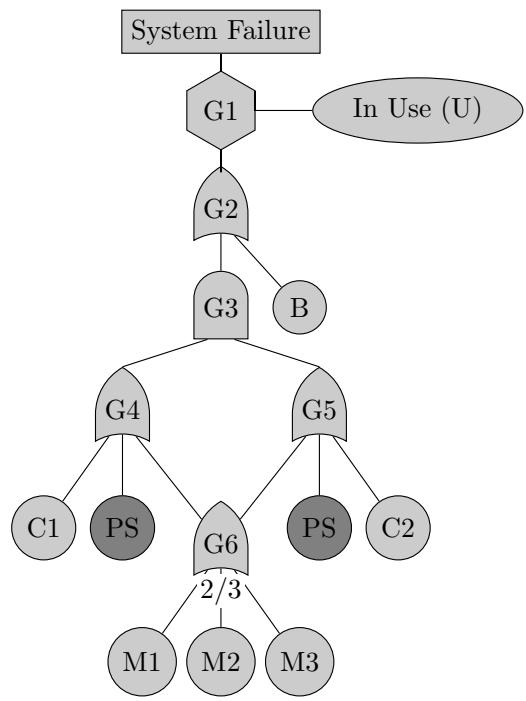

顶层是 System Failure，经 INHIBIT 门 G1 与运行条件 In Use (U) 相连；G2 将总线失效 B 与计算子系统失效组合；冗余 CPU、共享电源和 2/3 存储表决门继续向下展开。该图展示了正式 FTA 的纵向阅读顺序：顶事件在上、门居中、基本事件在叶端，共享事件用重复但一致的叶节点表示。

可借鉴之处：

- 正文主图中的“失控”应明确画成顶事件，而不是普通流程起点；
- AND/OR 门应占据父事件与子事件之间的独立层级；
- 条件、共享事件与表决逻辑需用符号表达，不能只靠连线颜色暗示；
- 树本体宜保持黑白或低饱和，状态色留给运行时诊断覆盖层。

### Figure 3：标准门符号

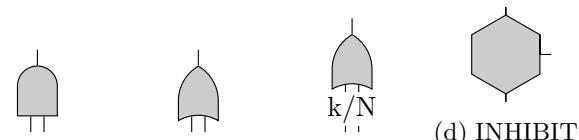

解析图保留了 AND、OR、k/N 和 INHIBIT 四种标准门。对本文而言，最关键的是统一 OR/AND 的形状并在图例中显式命名；如果 D/S/P 是领域分支，它们应作为事件/子树标签，而不是自创门形状。

### Figure 12：动态故障树中的共享备件竞争

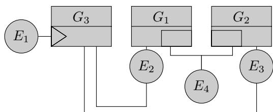

图中多个 SPARE 门可能竞争同一个备件 E4。当 E1 失效时，E4 的分配可能具有非确定性，不同工具若采用不同抢占策略，会得到不同分析结果。它说明：一旦图中要表达“先后顺序、资源占用或运行时选择”，就已经超出普通静态 AND/OR 树，应单独引入动态语义并写清规则。

使用边界：这篇综述建立正式 FTA 语法和分析语义，但不涉及 LLM/Agent 编排。

---

## 6. Marksteiner 等：从 TARA、攻击树到自动测试

### 文章核心内容

论文面向 UNECE R155 与 ISO/SAE 21434 背景下的汽车网络安全验证，把 TARA 产生的威胁模型转换成攻击树，再用攻击描述 DSL 给树边标注动作，从而形成标记转移系统（LTS）。LTS 中每条带标签路径天然对应一个抽象测试场景；作者还把 Cybersecurity Assurance Level（CAL）与 Targeted Attack Feasibility（TAF）作为路径成本，并通过补充实现细节把抽象场景编译为具体测试。

- 文献库编号：W-sha-020b5130e2d6
- PDF/source-file 编号：SF-020b5130e2d6-00247
- 解析：succeeded，后端 vlm

### Figure 3：系统架构上的攻击路径

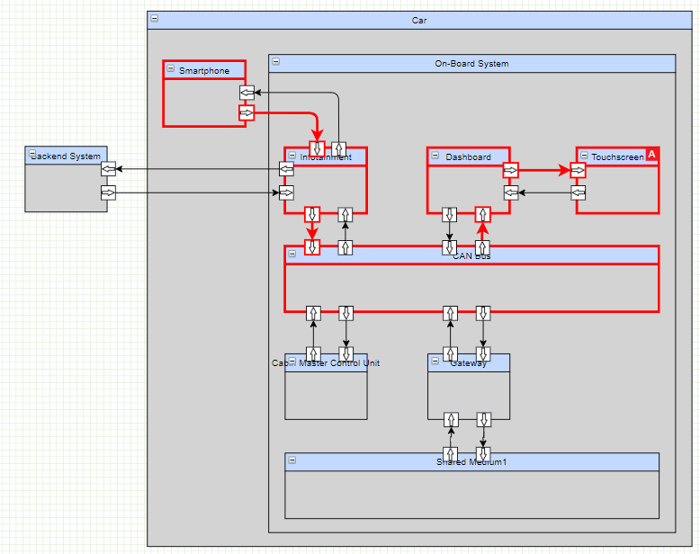

红线把 Smartphone、Infotainment、CAN Bus、Dashboard 与 Touchscreen 串成候选攻击路径，灰黑线保留完整系统连接。它不是攻击树本体，却展示了攻击树节点从何处来：先在架构图上识别入口、传播边和目标，再把路径抽象为树节点。

### Figure 4：带属性卡片的攻击树

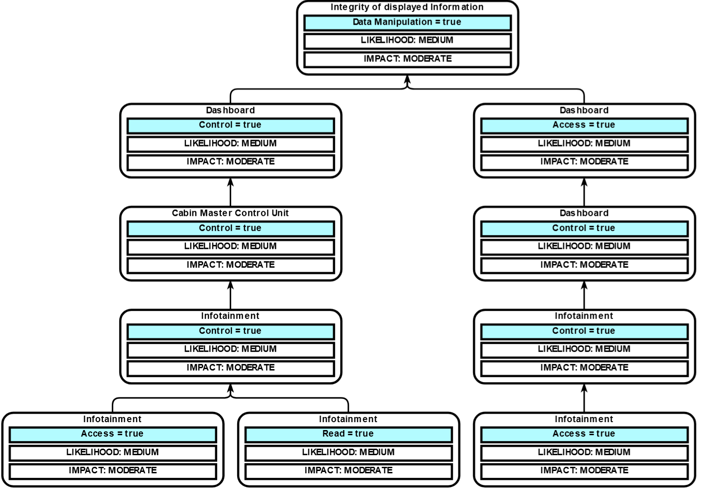

根目标是破坏 displayed information 的完整性；下层节点分别表达对 Dashboard、Cabin Master Control Unit 和 Infotainment 的 Access、Read 或 Control 状态。每个节点同时携带 likelihood 与 impact，分支表示达到上层目标的不同路径。

可借鉴之处：

- 节点标题与状态谓词分层排版，比把完整句子塞在一个框中更清楚；
- likelihood/impact 等评估信息可作为节点附属字段，但不应替代门语义；
- 两条候选路径并列时，应保持相同垂直层级，便于比较路径长度和前置条件。

### Figure 5：DSL 测试场景

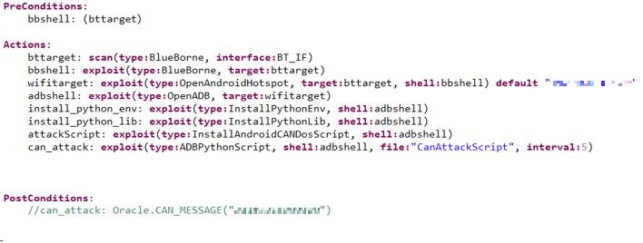

该代码式图把前置条件、扫描/利用/安装/执行动作和后置条件写成技术无关的测试场景。它说明树叶或边上的“动作”需要一个可执行但可移植的中间表示，不能直接等同于具体工具命令。

### Figure 6：攻击树路径到测试模式序列

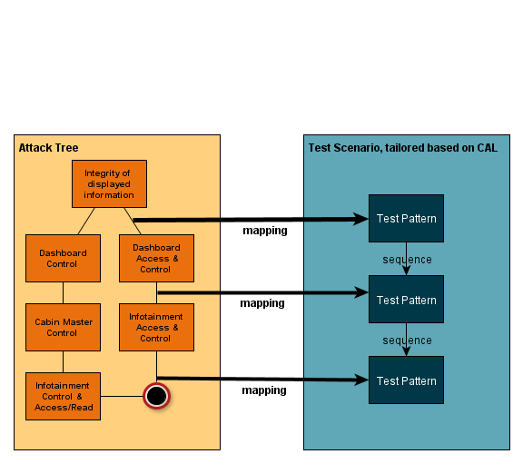

左侧攻击树选择一条从叶节点到顶目标的路径，右侧把沿途边映射为顺序执行的 Test Pattern。核心不是简单“树 → 测试”箭头，而是逐边映射、保持顺序、再形成场景序列。这与本文“冻结失控树 → 选择诊断路径 → 编排受控对照/测试”的转换最接近。

使用边界：其树主要是攻击前置状态与路径模型，并不采用经典 FTA 的 AND/OR 门形状；引用时应区分攻击树路径语义与故障树布尔语义。

---

## 7. Mahmood 等：STRIDE、攻击树与 OTA 安全测试

### 文章核心内容

论文针对汽车 OTA/Uptane 更新系统，提出系统化威胁评估与模型化安全测试流程：先用 Microsoft Threat Modeling Tool 和 STRIDE 枚举威胁，再通过专家细化构建攻击树，由自研工具分析树结构、派生测试用例并执行测试。研究构建了 15 个测试用例，发现 Uptane 参考实现能抵御多类篡改攻击，但在信息泄露和拒绝服务方面仍存在风险。

- 文献库编号：W-sha-8c16756d6055
- PDF/source-file 编号：SF-8c16756d6055-00246
- 解析：succeeded，后端 vlm

### Figure 3：攻击树节点层级示意

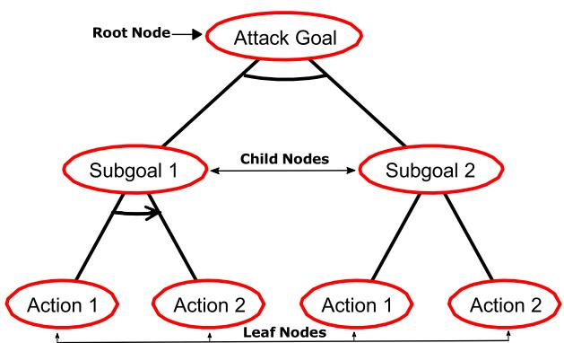

图用根目标、子目标与原子动作三层说明攻击树基本结构。正文进一步规定 OR、AND 与 Sequential AND（SAND）：OR 表示至少一条子路径完成，AND 表示所有子任务均需完成但不限定顺序，SAND 则要求按顺序执行。对本文而言，SAND 是表示诊断/测试先后依赖的直接参考，但必须在图例中与静态 AND 区分。

### Figure 10：未认证下载固件

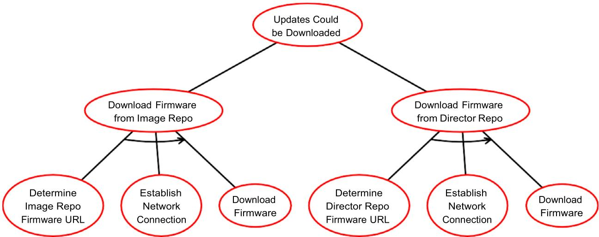

顶目标 Updates Could Be Downloaded 通过 OR 分成 Image Repo 与 Director Repo 两条路径；每条路径内部由确定 URL、建立连接、下载固件组成顺序子树。它适合参考“顶目标—候选路径—原子步骤”的三层布局。

### Figure 11：数据流嗅探

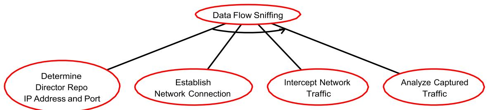

四个动作共同完成 Data Flow Sniffing：确定地址和端口、建立连接、截获流量、分析流量。图用箭头提示先后关系，属于典型 SAND 视觉表达。其优点是宽而浅，适合动作数量有限且顺序明确的攻击链。

### Figure 12：Director Repository 拒绝服务

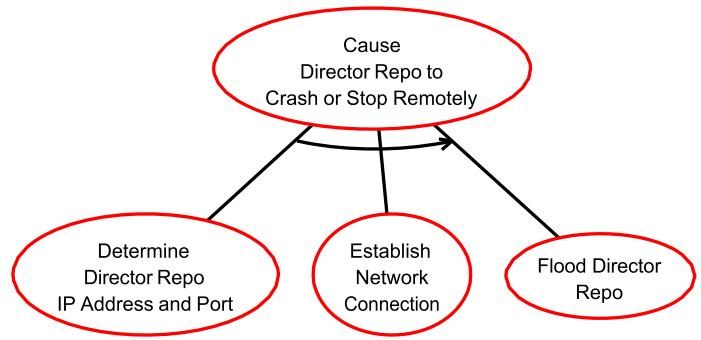

顶目标由三个顺序动作实现：确定 Director Repo 的地址与端口、建立网络连接、发送洪泛请求。该图非常紧凑，可作为本文局部诊断路径/对照序列的简化模板。

### Figure 13：按 STRIDE 组织的总体攻击树

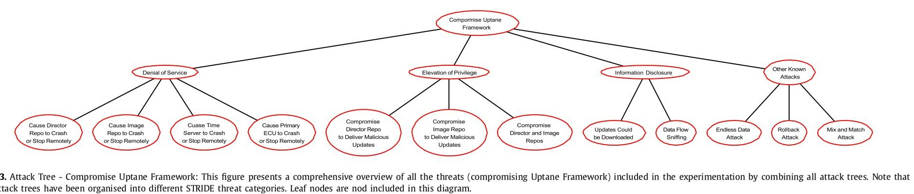

顶层目标是 Compromise Uptane Framework，下层按 Denial of Service、Elevation of Privilege、Information Disclosure 与 Other Known Attacks 分组，再列出各具体攻击目标。作者刻意省略叶动作，只保留目标层级，因此它更像“总览索引树”，具体执行细节由 Figure 10–12 的子树承载。

可借鉴之处：

- 总图只画到威胁/失控模式层，详细动作放在局部子图；
- 类别层可以承担导航与颜色身份，但逻辑门仍需单独表达；
- 同一论文同时给出总体树和局部展开树，比在一张图塞入全部叶节点更易读；
- 适合把本文主图中的失控树保持为总览，再用一个放大节点示范诊断与测试编排。

使用边界：总体树按 STRIDE 组织，属于攻击目标分类与 OR 分解，不应直接等同于安全故障树或定量 FTA。

---

## 对本文主图的直接启示

建议新版主图采用以下分工：

- 左端失控树：按 Ruijters–Stoelinga 保留正式顶事件、OR/AND 门和 D/S/P 事件分支，动态顺序另用 SAND/动态门图例表达；
- 诊断状态：借鉴 Structured Attack Trees Figure 2，只显示状态、发现和允许的下一对照；
- 树到执行：结合 STAF 与 Marksteiner Figure 6，把批准树作为不可被运行时 Agent 改写的输入，并将选定路径逐边映射为对照/测试序列；
- 整图分栏：借鉴 VERA 的风险结构—案例编译—执行验证分区；局部树展开参考 Mahmood Figure 10–12；
- 分支配色：借鉴 SAGE 的稳定类别颜色，但必须明确颜色只是视觉身份，不代表额外逻辑门或第四结果分支；
- 反馈路径：只让核验后的证据记录回流到后续探索/修订入口，不直接覆盖冻结树。

## 解析状态与证据边界

三篇新增论文已经完成正式解析并通过状态/文件一致性核对：

| 论文 | W 编号 | SF 编号 | 状态 | 后端 | 本文收录 |
|---|---|---|---|---|---|
| Fault tree analysis: A survey of the state-of-the-art in modeling, analysis and tools | W-sha-81fe14f467a7 | SF-81fe14f467a7-00248 | succeeded | vlm | Figure 1、3、12 |
| From TARA to Test: Automated Automotive Cybersecurity Test Generation Out of Threat Modeling | W-sha-020b5130e2d6 | SF-020b5130e2d6-00247 | succeeded | vlm | Figure 3–6 |
| Systematic threat assessment and security testing of automotive over-the-air updates | W-sha-8c16756d6055 | SF-8c16756d6055-00246 | succeeded | vlm | Figure 3、10–13 |

质量说明：

- 文献库健康检查未发现 orphan、phantom、状态不一致或 dangling reference；
- 图像均来自各自 literature_parse_runs.content_md_path 所引用的 images/ 资产；
- Ruijters Figure 1 与 Figure 3 在解析稿中被拆成相邻片段，已依据图注与视觉内容重新归属；
- Marksteiner 的双栏阅读顺序导致图注与资产相邻次序错位，已对照图面内容校正 Figure 3–6；
- Mahmood Figure 13 的解析资产为竖向保存，已转向便于阅读，树结构未改动；
- 这些内容属于“已解析并完成图像核对”的探索性参考，不自动升级为论文正文中的正式引用证据。

Falco 与 Gilpin 的 A Stress Testing Framework for Autonomous System Verification and Validation (V&V) 作者公开下载地址此前返回 HTTP 403；当前仍未创建不完整 PDF 或伪造入库记录。

