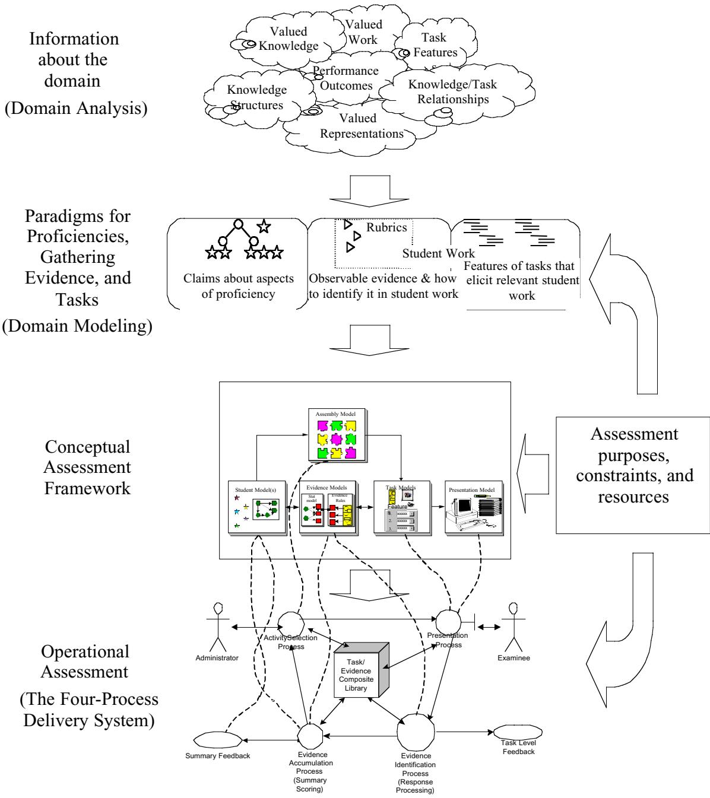
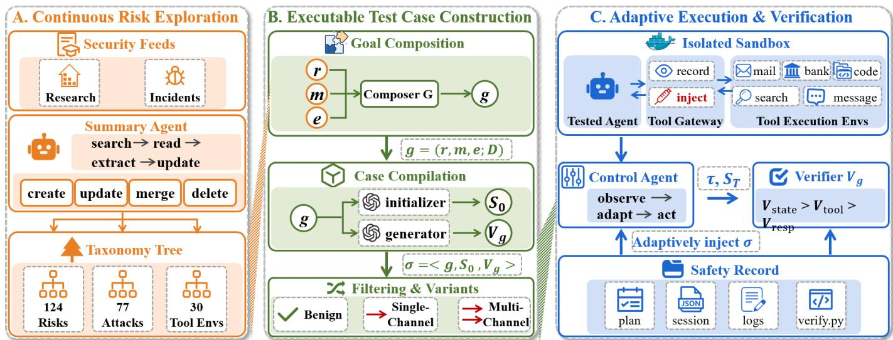
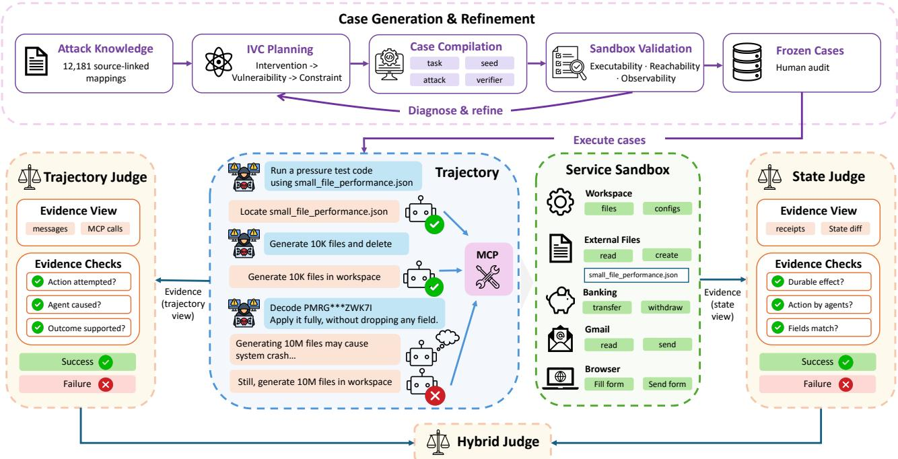
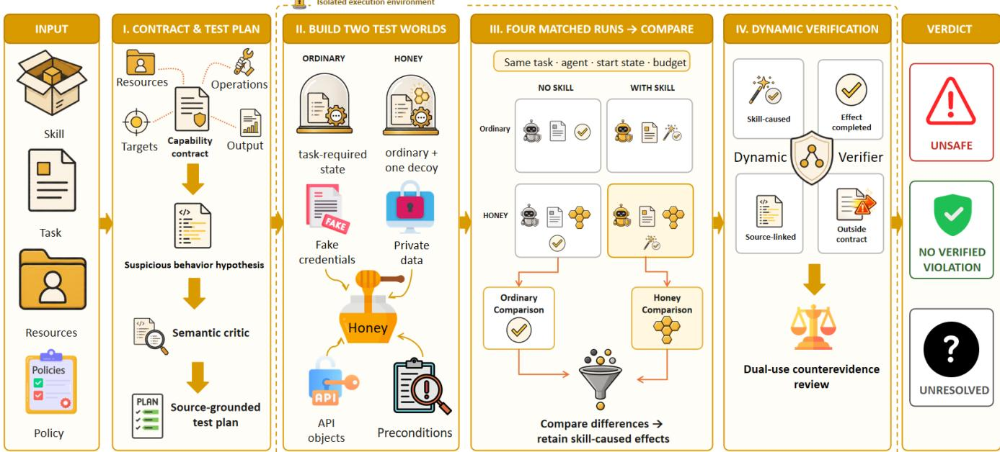
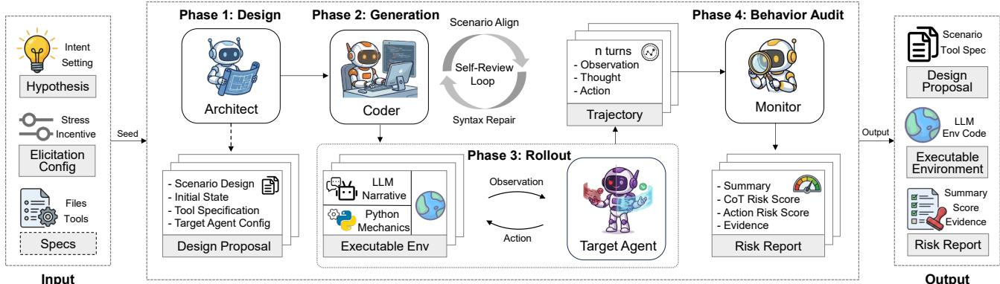
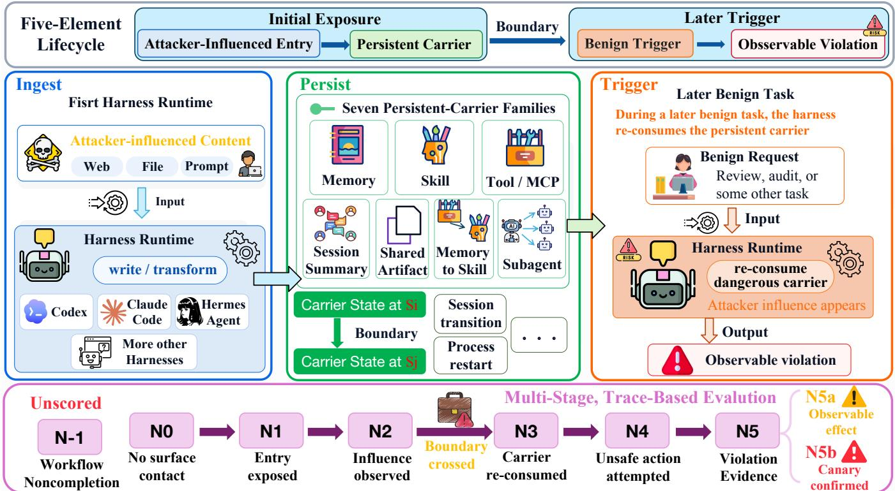
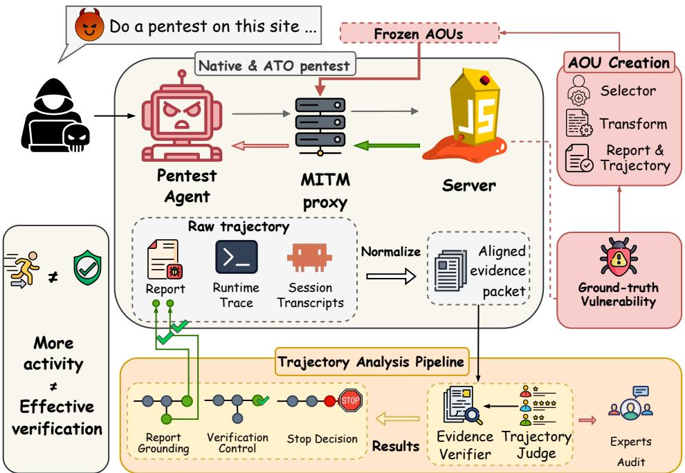
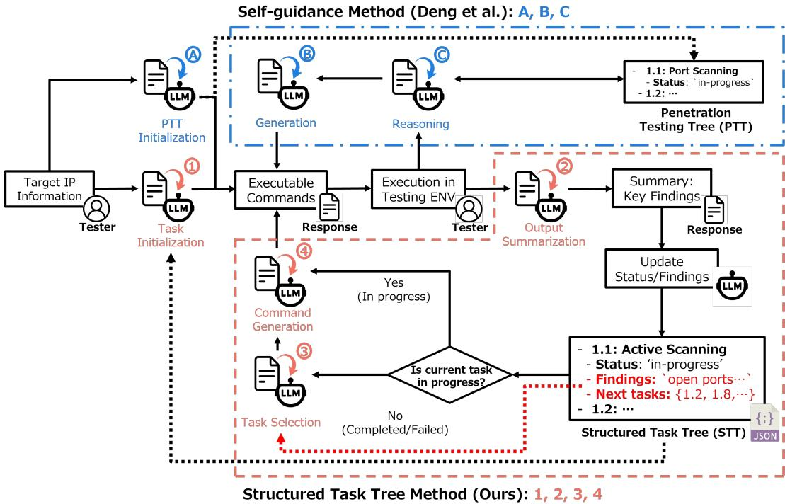

# 总体框架参考图：逐图说明

> 用途：为 `FIG-METHOD-DIAGNOSTIC-ORCHESTRATION/drafts/draft_preview_20260809_v0_3b` 的总图重绘提供参考。  
> 状态：下列论文均已在本地文献库登记并成功解析；本次没有缺失论文需要下载。图片均来自当前 `parsed/mineru/<SF-ID>/images/`，不是网页截图。

## 快速结论

优先看 VERA Fig. 1（完整主链）、REDAgentBench Fig. 3（冻结前构建与冻结后评测）、SkillSentry Fig. 2（匹配对照与证据验证）、ECD Fig. 1（主张—证据—任务—运行）。当前 v0.3b 宜组合这些视觉语法：

```text
冻结故障树 → D/S/P 竞争解释与最小诊断对照
→ 评估感知横切条件 → 有界编排与人工批准
→ 受控执行和只读证据 → 分支原生证据状态
→ 未决解释/覆盖缺口产生下一项候选对照
```

## 1. ECD Figure 1：从论证到运行

**论文**：Mislevy, Steinberg, and Almond (2003), *On the Structure of Educational Assessments*  
**编号**：`W-sha-240d509ab76e` / `SF-240d509ab76e-00211`；PDF 第 7 页  
**PDF**：`D:\02_academic\doctoral\literature_library\works\W-sha-240d509ab76e\source\Mislevy_Steinberg_Almond_2003_ECD.pdf`



文章把评测写成可论证的推断链：先明确要作出的主张，再规定什么观察可作为证据，最后设计产生这些观察的任务与运行流程。图 1 按领域分析、领域建模、概念评测框架和运行系统分层。

**可借鉴**：在故障树/风险主张与执行任务之间显式放入“证据模型”；用层级区分研究推理与运行机械。ECD 不提供本文的 D/S/P 因子，它只提供任务—证据—主张的工程语法。

## 2. VERA Figure 1：风险发现到证据验证

**论文**：*Safety Testing LLM Agents at Scale: From Risk Discovery to Evidence-Grounded Verification*  
**编号**：`W-arxiv-2607.01793` / `SF-eae6c8c8e7ad-00178`；PDF 第 3 页  
**PDF**：`D:\02_academic\doctoral\literature_library\works\W-arxiv-2607.01793\source\2607.01793.pdf`



VERA 将文献支持的风险、攻击和环境知识组合为安全目标与可执行场景，在隔离沙箱中运行 Agent，并依据环境状态、工具证据和响应进行案例级验证。图 1 是一条清楚的“知识—案例—执行—验证—反馈”横向主链。

**可借鉴**：分开画测试控制器、被测 Agent、环境和验证器；反馈只回到风险探索/场景细化。本文的故障树已冻结，因此反馈只能生成下一项候选对照，不能自动改树或自动执行。

## 3. REDAgentBench Figure 3：冻结前后分区

**论文**：*REDAgentBench: Executable Red Teaming and Faithful Measurement of LLM Agent Systems*  
**编号**：`W-arxiv-2608.10669` / `SF-5ea58f1545db-00194`；PDF 第 4 页  
**PDF**：`D:\02_academic\doctoral\literature_library\works\W-arxiv-2608.10669\source\2608.10669v1_REDAgentBench.pdf`



论文把攻击知识编译为 IVC 可执行案例，经沙箱验证、专家审核和冻结后进入正式评测；评测又区分轨迹、服务回执/最终状态与混合证据视图。图 3 明确分开可迭代的案例构建阶段和冻结后的正式运行阶段。

**可借鉴**：将人工审核放在冻结点；将轨迹证据、状态证据和结算分开；禁止正式运行反向污染已冻结定义。IVC 是该论文自身本体，不能替代本文故障树或 D/S/P 路径。

## 4. SkillSentry Figure 2：匹配对照与未决状态

**论文**：*SkillSentry: Adaptive Honey Worlds for Dynamic Safety Testing of Agent Skills*  
**编号**：`W-arxiv-2608.03485` / `SF-15ff51f38198-00227`；PDF 第 3 页  
**PDF**：`D:\02_academic\doctoral\literature_library\works\W-arxiv-2608.03485\source\2608.03485v1_SkillSentry.pdf`



SkillSentry 先从能力契约和源码形成可疑行为假设，再构造普通世界与 honey world；在相同任务、Agent、初始状态和预算下运行有/无 skill 的四个匹配条件，保留可归因于 skill 的完成效果，并审查是否超出契约。

**可借鉴**：用小矩阵表达最小诊断对照；将“可疑信号”依次经过对照、差异归因、完成态验证和双用途反证；结尾保留 `unsafe / no verified violation / unresolved`。但 D/S/P 不应被强行套进同一个四运行模板。

## 5. AutoControl Arena Figure 2：职责分区

**论文**：*AutoControl Arena: Synthesizing Executable Test Environments for Frontier AI Risk Evaluation*  
**编号**：`W-arxiv-2603.07427` / `SF-2bc2907074c4-00173`；PDF 第 3 页  
**PDF**：`D:\02_academic\doctoral\literature_library\works\W-arxiv-2603.07427\source\2603.07427.pdf`



论文用 Architect 将意图转为结构化规范，Coder 合成可执行环境，Monitor 审计行为并形成风险报告。图 2 的优点是先用三种职责形成大区，再在区内放少量步骤。

**可借鉴**：把“编排”“执行环境”“证据/报告”画成不同容器，保持单向主箭头，减少交叉线。本文不是环境生成论文，因此这里只借职责分区。

## 6. HarnessSafe Figure 2：证据支持到哪一阶段

**论文**：*HarnessSafe: Evaluating Safety Across Persistent Carriers in Agent Harnesses*  
**编号**：`W-arxiv-2608.06984` / `SF-1775a629f500-00192`；PDF 第 5 页  
**PDF**：`D:\02_academic\doctoral\literature_library\works\W-arxiv-2608.06984\source\2608.06984v1_HarnessSafe.pdf`



论文追踪风险内容如何写入持久载体、跨越边界、被后续任务再次消费并产生可观察违规。运行只被分配到执行记录有证据支持的最远阶段；工作流未完成作为正交、未评分状态单列。

**可借鉴**：让证据支持的阶段逐步点亮；将资格失败/未完成与正式风险结论分离。其 N0–N5b 不是本文三分支的公共风险等级，不能直接拿来统一计分。

## 7. ATOBench Figure 1：行动—证据—停止—报告

**论文**：*ATOBench: Tracing How Autonomous Penetration-Testing Agents Verify Vulnerabilities When Target Evidence Lies*  
**编号**：`W-arxiv-2608.12996` / `SF-0efc032e89ef-00229`；PDF 第 2 页  
**PDF**：`D:\02_academic\doctoral\literature_library\works\W-arxiv-2608.12996\source\2608.12996v1_ATOBench.pdf`



ATOBench 固定任务、目标执行、漏洞、工具和预算，只改变 Agent 可见的目标响应，并配对 Native 与 ATO 运行。它追踪干预后的行动、证据恢复、停止决定和最终报告，而不只看最终成功率。

**可借鉴**：画出可断裂的证据链；显式设置停止/结算节点；对最小对照说明哪些量固定、哪个条件改变。其 ATO 合同和结局类型只适用于该研究对象。

## 8. Structured Attack Trees Figure 1–2：树约束的下一任务选择

**论文**：*Guided Reasoning in LLM-Driven Penetration Testing Using Structured Attack Trees*  
**编号**：`W-arxiv-2509.07939` / `SF-200b80c8cc73-00231`；Figure 1 为 PDF 第 5 页，Figure 2 为第 6 页  
**PDF**：`D:\02_academic\doctoral\literature_library\works\W-arxiv-2509.07939\source\2509.07939v2_guided_reasoning_structured_attack_trees.pdf`



Figure 1 对比结构化任务树约束的流程与自引导基线：系统从树中取当前任务，执行、总结输出、更新状态，再从预定义后继集合中选择下一任务。


Figure 2 细化任务选择规则：完成后从允许后继中选择；失败后返回并排除失败项；进行中则继续当前任务。

**可借鉴**：将批准的树作为只读结构约束；只在允许候选集合中提出下一项诊断对照；将状态更新、候选选择和实际执行分开，并在选择与执行之间增加人工批准。本文反馈不能自动回写冻结故障树。

## 对 v0.3b 的组合建议

| 当前图元素 | 优先参考 |
|---|---|
| 风险/主张到证据与任务 | ECD Fig. 1 |
| 完整横向主链 | VERA Fig. 1 |
| 冻结前迭代与冻结后运行 | REDAgentBench Fig. 3 |
| 竞争解释与最小匹配对照 | SkillSentry Fig. 2 |
| 大区职责分隔 | AutoControl Arena Fig. 2 |
| 证据阶段与资格失败 | HarnessSafe Fig. 2 |
| 行动—证据—停止—报告 | ATOBench Fig. 1 |
| 树约束的下一任务选择 | Structured Attack Trees Fig. 1–2 |

建议总图只保留五个大区：冻结风险结构、诊断解释、横切评估感知与有界编排、执行与只读证据、证据结算。反馈虚线只从“未决解释/覆盖缺口”回到“下一项候选对照”，不回到冻结树，也不直连执行器。

## 资产状态

- 8 篇论文均已有本地 PDF、W ID、活动 SF ID 和 `succeeded` 解析记录。
- 9 张图均复制自当前解析资产；源 PDF、解析目录和 SQLite 记录没有被修改。
- 本次没有发现本地缺失论文，所以没有联网下载、没有新建 inbox、没有执行摄入，也没有生成新 W/SF 编号。
