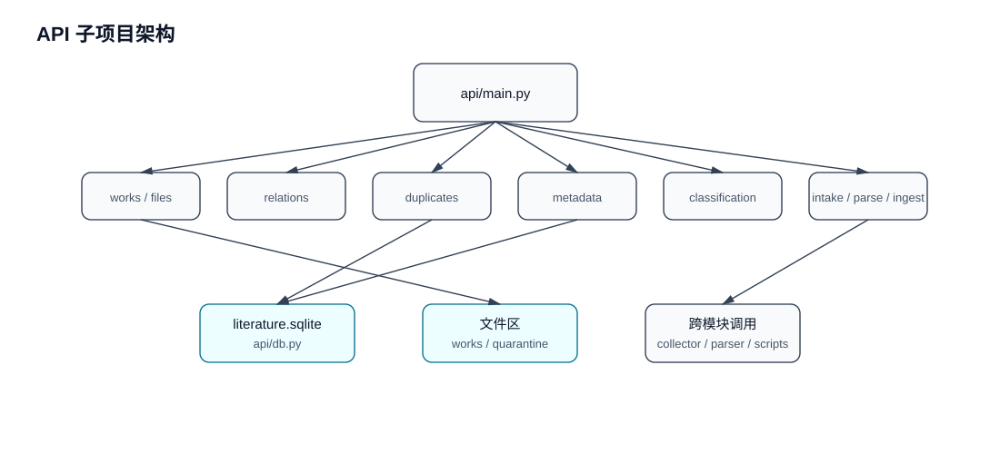

# API 子项目架构

`api/` 是文献库的 FastAPI 后端，对浏览器 UI 和 agent/API 调用暴露统一入口。

## 内部结构

## 对外契约

- 所有业务路由挂在 `/api` 前缀下。
- UI 通过 `web/src/api.js` 消费这些接口。
- 关键写操作需要同时维护 SQLite 状态和文件路径一致性。
- `metadata`、`classification`、`intake`、`parse` 是 agent/API 自动化最常用的入口。

## 本文件维护范围

只记录 API 层路由、数据访问和跨模块调用关系；具体业务流程维护在 `docs/workflows/business-flows.md`。
