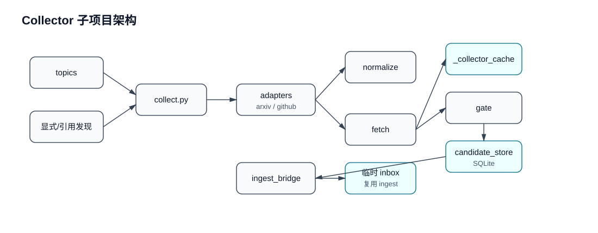

# Collector 子项目架构

`collector/` 负责把外部线索变成可审核的 intake candidates，并在批准后推进到正式摄入链路。

## 内部结构

## 职责边界

- 负责发现、下载、规范化、SHA256 门控和候选状态管理。
- 不负责最终文献稳定层的完整写入；正式入库必须经 `ingest_bridge` 复用 ingest 链路。
- 下载产物优先进入 `_collector_cache`，审核通过后才晋升。
- 与 UI/API 的协作主要通过 `api/routes/intake.py` 和 topics/candidates 相关表。
