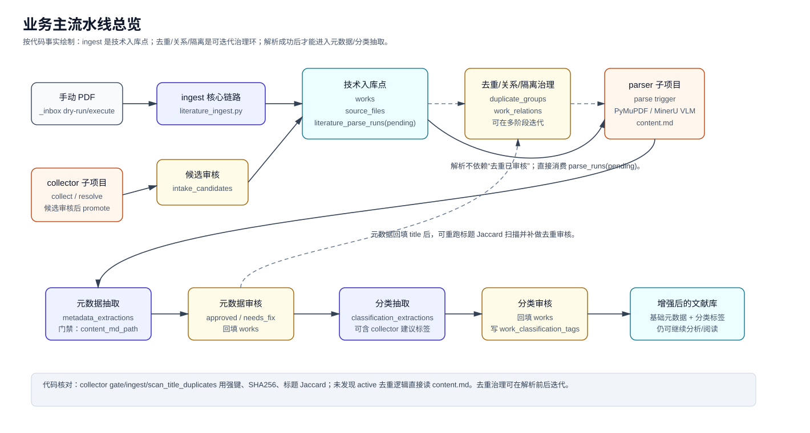
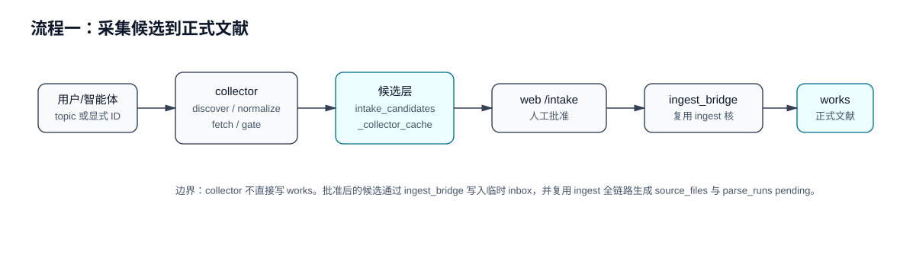
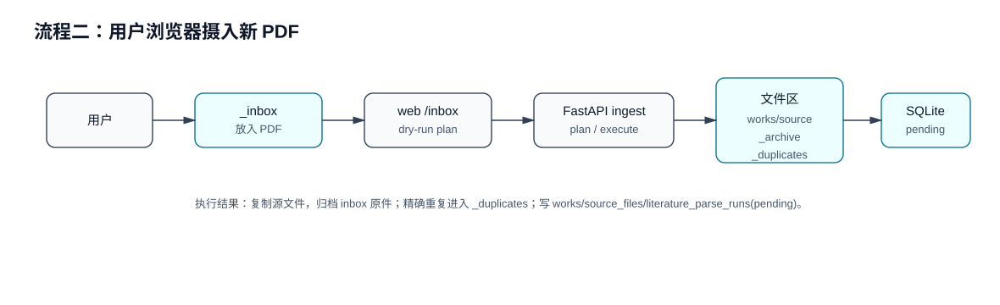
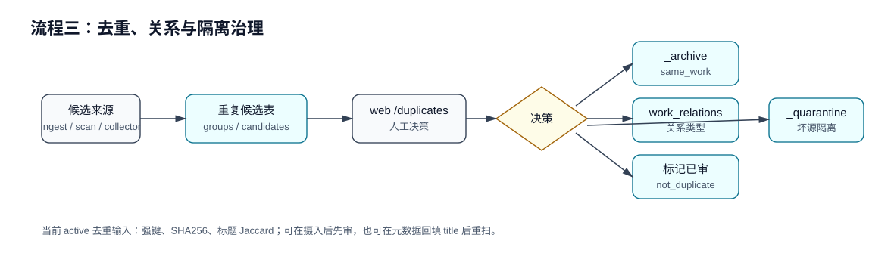
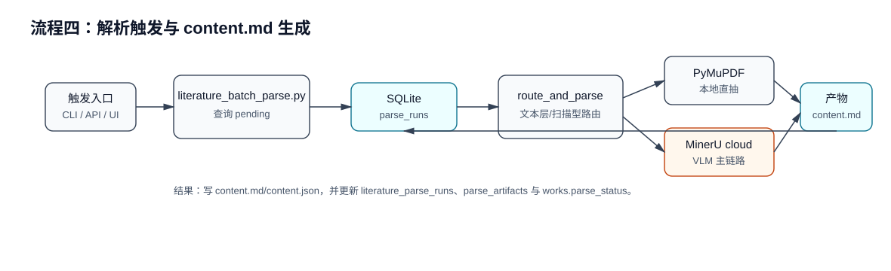
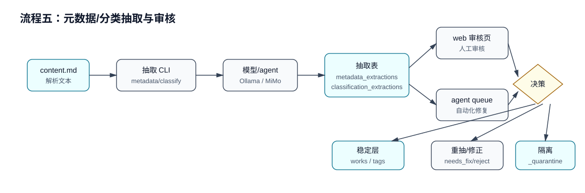

# 业务流程图

> 最后更新：2026-06-30  
> 范围：用户浏览器操作、智能体 CLI 操作、API 自动化操作，以及跨 `web`、`api`、`collector`、`parser`、`scripts` 的协作。

## 总览



这张总览按代码事实区分两个层次：

- **技术入库点**：`ingest` 或 `collector -> ingest_bridge -> ingest` 写入 `works`、`source_files`，并创建 `literature_parse_runs(pending)`。从数据库角度，这时已经进入文献库。
- **SHA256 精确重复**：在 ingest 内部硬拦截，重复文件直接归档到 `_duplicates/exact_sha256`，不进入后续流程。
- **标题重复治理**：ingest 会生成 Jaccard 标题相似候选写入 `duplicate_groups`/`duplicate_candidates`，但不阻塞入库。审核可在摄入后或元数据回填 title 后迭代进行。
- **元数据/分类抽取门禁**：`literature_parse_runs.status='succeeded'` 且存在 `content_md_path`，与去重审核状态无关。

## 流程一：采集候选到正式文献



> 边界：collector 不直接写 `works`；批准后的候选经 `ingest_bridge` 进入同一个 ingest 核心链路。

## 流程二：用户浏览器摄入新 PDF



## 流程三：标题重复治理



## 流程四：解析触发与 content.md 生成



## 流程五：元数据/分类抽取与审核



## 流程六：主题驱动发现检索


> 边界：Discovery 是"检索计划与命中证据池"，不直接写 works/intake/ontology；accept 后经唯一桥梁函数进入 intake 候选池，再走标准闸门链路。

#### 6.1 三模块关系概要

| 模块 | 角色 | 数据表 | 核心操作 |
|------|------|--------|----------|
| Topic Gate | **前置输入源** & 成熟度管理 | collection_topics | 管理 query_def、触发 plan/run |
| Discovery | 受约束的发现检索 | discovery_runs + discovery_hits | Agent 回填 hits、人工审核 accept/reject |
| Intake | 候选审核闸门 | intake_candidates | light_gate → heavy_gate → A2 review → promote |

**关键理解**：Topic Gate 不是后置分类器，而是 Discovery 的结构化输入来源。

#### 6.2 推荐数据流

```
TopicsReview (/topics) 创建/选择 topic
  ↓ topic_id + query_def
POST /api/discovery/plan 或 /api/discovery/composite-plan
  ↓ search_plan_json
POST /api/discovery/run → discovery_runs
  ↓ Agent 按 plan 执行检索
POST /api/discovery/runs/{id}/hits → discovery_hits
  ↓ 用户在 DiscoveryReview (/discovery) 审核
POST /api/discovery/hits/{id}/accept → accept_hit_to_intake()
  ↓ intake_candidates (resolution='pending', review_status='pending')
  ↓ light_gate → heavy_gate → A2 review (approved)
POST /api/intake/promote → ingest_bridge → works
```

#### 6.3 支持的输入模式

| 模式 | 触发方式 | 说明 |
|------|----------|------|
| topic | TopicsReview → 生成方案 | 基于 topic.query_def 生成计划 |
| name | 手动输入名称 | 按模型名/系统名检索 |
| title | 手动输入标题关键词 | 按标题短语检索 |
| url | 手动输入 URL | 创建 manual hit |
| composite (V1.2) | 复合表单多字段输入 | names+titles+authors+institutions+keywords+known_urls+... 组合查询 |

#### 6.4 硬约束（V1.1/V1.2 不变）

- Agent 只能回填 discovery_hits
- 不自动 accept、promote、写 works、改 ontology vocab、下载 PDF
- Hit 只通过 POST /api/discovery/runs/{id}/hits 回填
- Accept 后只创建 intake_candidates(resolution='pending')
- Title-only hit 不能批量接受
- 已知 URLs 仅作 source_hint，不自动创建 hit
- DOI/arXiv/GitHub 不作为自动 discovery mode

#### 6.5 与 Collect 的区别

| 维度 | Discovery | Collect |
|------|-----------|---------|
| 目的 | 从开放网络**检索发现**未知文献 | 按**已知 ID** 采集已有文献 |
| 输入 | 关键词/名称/多信号组合 | arXiv ID / GitHub URL / DOI |
| 输出 | discovery_hits（证据池） | 直接进入 intake_candidates |
| 审核 | 必须人工 accept | 经 gate 后 review |
| 自动化程度 | Agent 执行检索 | 半自动采集 |
| 典型场景 | "找关于 X 的所有相关论文" | "采集 arXiv:xxxx 这篇论文" |

#### 6.6 替代路径：Direct Collect

用户可以跳过 Discovery，直接从 Topic 发起 Collect：
```
TopicsReview → POST /api/intake/collect → intake_candidates
```
这条路径绕过 Discovery，直接进入 Intake 候选池。适用于已知精确 ID 的场景。
