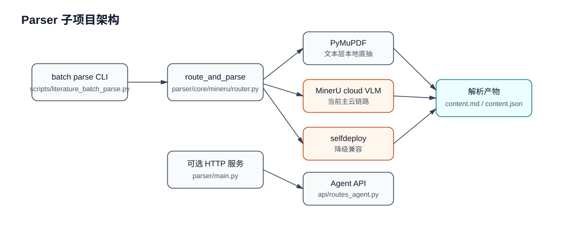

# Parser 子项目架构

`parser/` 是文档解析子项目。文献库当前主要通过 `scripts/literature_batch_parse.py` 进程内调用 `parser/core/mineru/`，通常无需单独启动 HTTP 服务。

## 内部结构

## 职责边界

- 负责从源 PDF/文档生成解析产物，不负责文献业务审核。
- `content.md` 是后续元数据、分类、分析流程的主要文本入口。
- 解析状态写回由调用方维护到 `literature_parse_runs` 和 `parse_artifacts`。
- 不应把旧自部署双服务画成默认路径；它只作为降级兼容或历史部署参考。
