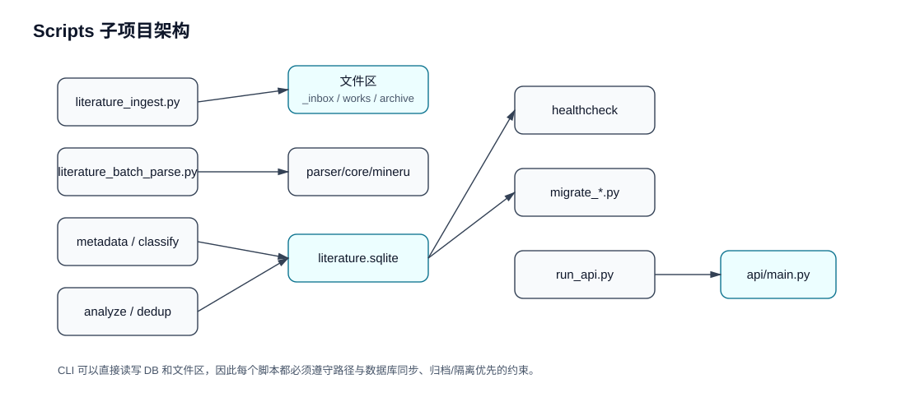

# Scripts 子项目架构

`scripts/` 放置本地维护 CLI，是 agent 批处理和人工维护的重要入口。

## 脚本分组

## 职责边界

- CLI 可以直接读写 SQLite 和文件区，因此必须遵守归档/隔离优先、路径与 DB 同步的约束。
- 面向 agent 的长任务应先生成计划或候选，再由审核流程批准后写入稳定层。
- 迁移脚本属于一次性结构变更入口，运行前应先确认数据库快照或备份策略。
